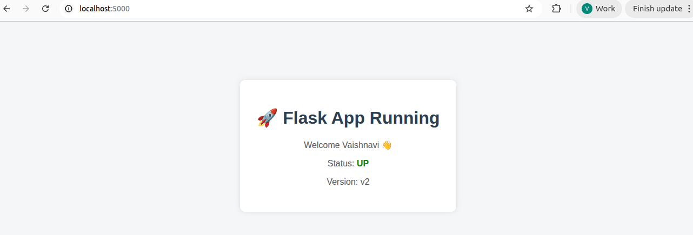
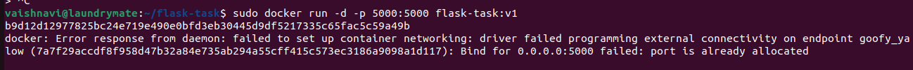
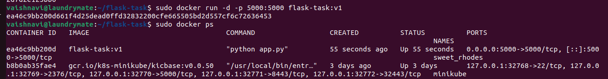
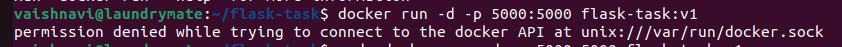
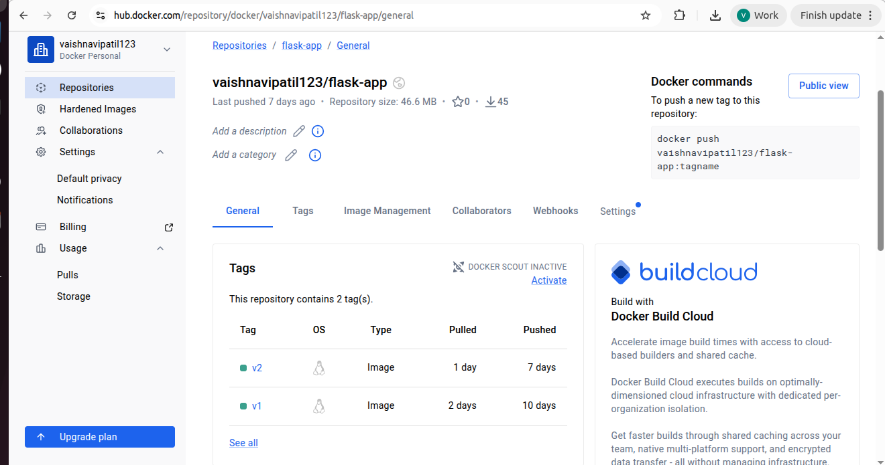

# DEVOPS_ASSIGNMENT

## Assignment-1:

```
Task 1: End-to-End Docker and Kubernetes Deployment

In this task, you need to take a simple web application (Node.js or Python Flask) 
and deploy it using Docker and Kubernetes. The goal is to understand how an 
application moves from local development to a container and then into a Kubernetes cluster.

You will start by creating a basic application that runs locally and responds on a specific port. 
Once it works, you must containerise it using Docker.

Write a proper Dockerfile using a lightweight base image and build the Docker image locally. 
Run the container and confirm it works correctly.

After that, push the Docker image to Docker Hub or GitLab Container Registry. 
Using Minikube or Kind, deploy the same image into Kubernetes.

Your implementation must include:

- A working application
- Dockerfile and .dockerignore
- Image build and push to registry
- Kubernetes Deployment YAML
- Kubernetes Service YAML
- Scaling replicas from 1 to 3
- Performing a rolling update by changing image version (v1 → v2)

You should also provide a short explanation covering:

- What happens when a pod crashes?
- Difference between Pod and Deployment
- Purpose of a Service in Kubernetes
- How rolling updates work
```
### Solution

Successfully completed Task 1 by implementing an end-to-end deployment process for a Flask application using Docker and Kubernetes.

The application was first tested locally through [`http://127.0.0.1:5000/`](http://localhost:5000/), then containerized using Docker and pushed to Docker Hub. The same image was deployed in a Kubernetes cluster using Minikube.

High availability was achieved through replica scaling, and application updates were managed using rolling deployment strategy from `v1` to `v2`.

### Steps

- Created Flask application.  
- Tested application locally.  
- Created `requirements.txt`.  
- Created `Dockerfile` and `.dockerignore`.  
- Built Docker image.  
- Ran Docker container.  
- Verified app in browser.  
- Pushed image to Docker Hub.  
- Installed `kubectl` and Minikube.  
- Started Kubernetes cluster.  
- Created Deployment YAML.  
- Created Service YAML.  
- Deployed app to Kubernetes.  
- Verified pods and services.  
- Accessed app through Minikube service.  
- Scaled replicas from 1 to 3.  
- Performed rolling update (`v1` to `v2`).

 ###  Screenshots are attached.

 <p align="center">
  <br><br>
  <br><br>
  <br><br>
  <br><br>
  <br><br>
  <br><br>
</p>

```
Task 2: Git Workflow and Branching
Understanding
This task focuses on strengthening your Git fundamentals and understanding real-world branching strategy
used in DevOps environments.
Create a new Git repository and initialise it properly. Work with multiple branches to simulate a real
development workflow.
You are expected to:
●​ Create main branch​
●​ Create dev branch from main​
●​ Create a feature branch from dev​
●​ Make meaningful code changes and commit properly​
●​ Merge feature branch into dev​
●​ Intentionally create and resolve a merge conflict​
●​ Tag the final version as v1.0​
●​ Show git log graph view​

```
## Solution

Successfully completed Task 2 by implementing a complete Git workflow and branching strategy commonly used in DevOps environments.

A new Git repository was initialized and multiple branches were created to simulate a real development lifecycle. Branches such as `main`, `dev`, and `feature` were managed properly. Meaningful code changes were committed, feature branch changes were merged into dev branch, merge conflicts were created and resolved successfully, final version was tagged as `v1.0`, and repository history was verified using Git log graph view.

---

## Steps

- Created a new Git repository and initialized it.  
- Created `main` branch.  
- Created `dev` branch from `main`.  
- Created `feature/my-feature` branch from `dev`.  
- Made code changes and committed with proper commit messages.  
- Merged feature branch into `dev`.  
- Intentionally created merge conflict between branches.  
- Resolved merge conflict successfully.  
- Tagged final version as `v1.0`.  
- Pushed branches and tag to remote repository.  
- Verified branch history using Git log graph view.  

---

## Commands Used

bash
git init
git branch -M main
git checkout -b dev
git checkout -b feature/my-feature
git add .
git commit -m "Added feature changes"
git checkout dev
git merge feature/my-feature
git tag -a v1.0 -m "Final version"
git push origin --all
git push origin v1.0
git log --oneline --graph --all

 ###  Screenshots are attached.

<p align="center">
  <br><br>
  <br><br>
</p>
